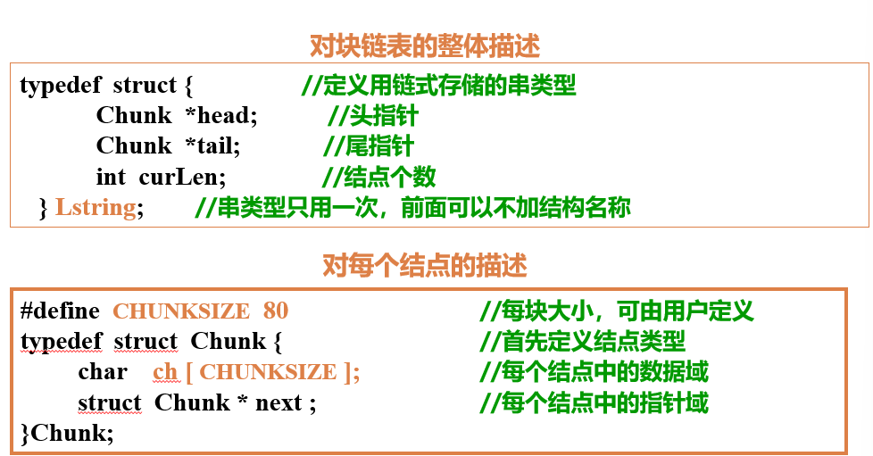

# 串

## 基本操作

~~~c
SubString(&Sub, S, pos, len)
操作结果：用Sub返回串S的第pos个字符起长度为len的子串
Index(S, T, pos)
操作结果：若主串S中存在和串T值相同的子串，则返回它在主串S中第pos个字符之后第一次出现的位置；否则返回0
Replace(&S, T, V)
初始条件：串 S、T 和 V 存在，T 是非空串。
操作结果：用 V 替换主串 S 中出现的所有与 T 相等的不重叠的子串。
StrInsert(&S, pos, T)
初始条件：串 S 和 T 存在，且满足 1 ≤ pos ≤ StrLength(S) + 1
操作结果：在串 S 的第 pos 个字符之前插入串 T。
StrDelete(&S, pos, len)
初始条件：串 S 存在，且满足 1 ≤ pos ≤ StrLength(S) - len + 1
操作结果：从串 S 中删除第 pos 个字符起长度为 len 的子串。
    
int strcmp(const char *s1, const char *s2)
{
    for ( ; *s1 == *s2; s1++, s2++)
        if (*s1 == '\0')
            return 0;
    
    return ((*(unsigned char *)s1 < *(unsigned char *)s2) ? -1 : +1);
}
~~~

## 存储结构

### 堆分配 

~~~C
typedef struct {
    char *ch;    //若非空串,按串长分配空间; 否则ch=NULL
    int length;   //串长度
}HString
~~~

### 块链存储

## BF算法

### 算法实现

~~~c
int Index_BF(SString S, SString T, int pos) // 见教材P79
{
    // 返回子串T在主串S中第pos个字符之后的位置。若不存在，则函数值为0。其中，T非空，1 <= pos <= StrLength(S)
    i = pos;
    j = 1;

    while (i <= S[0] && j <= T[0])
    {
        // 如果i、j二指针在正常长度范围，则继续比较后续字符
        if (S[i] == T[j])
        {
            ++i；
            ++j;
        } 
        else
        {
            i = i - j + 2;
            j = 1;
        } // 若不相等，指针后退重新开始匹配
    }
    if (j > T[0])
        return i - T[0]; // T子串指针j正常到尾，说明匹配成功，
    else
        return 0;
} // Index_BP
~~~

### 时间复杂度分析

主串长 $n$；子串长 $m$。可能匹配成功的位置 $(1 \sim n-m+1)$。

#### ① 最好的情况下：

第 $i$ 个位置匹配成功，前 $i-1$ 个位置每个位置只比较了一次，第 $i$ 个位置比较了 $m$ 次，总共比较了$(i-1+m)$平均比较次数：

$$
\sum_{i=1}^{n-m+1} p_i (i-1+m) = \frac{1}{n-m+1} \sum_{i=1}^{n-m+1} (i-1+m) = \frac{1}{2}(m+n)
$$

最好情况下算法的平均时间复杂度为 $\mathbf{O}(n+m)$。

#### ② 最坏的情况下：
第 $i$ 个位置匹配成功，但每个 $i-1$ 位置都比较了 $m$ 次，总共比较了 $(i \times m)$ 次，平均比较次数：

$$
\sum_{i=1}^{n-m+1} p_i (i \times m) = \frac{m}{n-m+1} \sum_{i=1}^{n-m+1} i = \frac{1}{2} m(n-m+2)
$$

设 $n >> m$，最坏情况下的平均时间复杂度为 $\mathbf{O}(n \cdot m)$。

## KMP算法

### 代码

~~~C
int Index_KMP(SString S, SString T, int pos) {
    i = pos;
    j = 1;
    while (i <= S[0] && j <= T[0]) {
        if (j == 0 || S[i] == T[j]) {
            ++i; 
            ++j; 
        } 
        else 
            j = next[j];                         // 模式串向右移动
    }
    if (j > T[0]) 
        return i - T[0];                // 匹配成功
    else 
        return 0;
}
~~~

### $next[j]$的求解

- 自己与自己做模式匹配
- 约定$next[1]= 0$，表示第一个字符不匹配，这样做的目的是使$i+1$
- 无首尾相同的子串时$next[j]=1$, 如$next[2]=1$

~~~C
void get_next(SString T, int next[]) {
    // 求模式串 T 的 next 函数值并存入数组 next。
    i = 1;
    next[1] = 0;
    j = 0;
    while (i < T[0]) {
        if (j == 0 || T[i] == T[j]) { 
            ++i;
            ++j; 
            next[i] = j; 
        }
        else
            j = next[j];
    }
}// get_next
~~~

