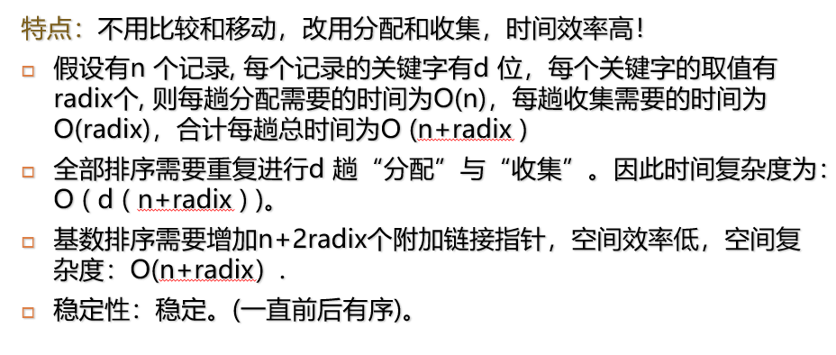
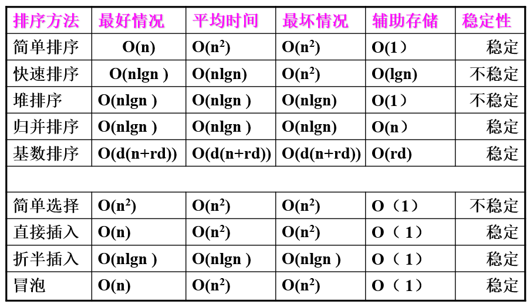

# 内部排序

- 稳定排序

~~~C
typedef struct {
    KeyType key;          // 关键字
    InfoType otherinfo;   // 其它数据项
} RecordType, node;       // 例如 node.key 表示其中一个分量
~~~

~~~C
typedef struct {
    RecordType r[MAXSIZE + 1];  // 存储顺序表的向量
    int length;                 // 顺序表的长度
} SqList L;                     // 例如 L.r 或 L.length 表示其中一个分量
~~~

## 插入排序

### 直接插入排序

~~~C
void InsertSort (SqList &L) {  // 对顺序表 L 作直接插入排序
    for (i = 2; i <= L.length; ++i) {  // 直接在原始无序表 L 中排序
        if (L.r[i].key < L.r[i-1].key) {  // 若 L.r[i] 较小则插入有序子表内
            L.r[0] = L.r[i];              // 复制为哨兵
            // 只要子表元素比哨兵大就不断后移直到子表元素小于哨兵
            for (j = i - 1; L.r[0].key < L.r[j].key; --j) {
                L.r[j + 1] = L.r[j];
            }
            // 哨兵值送入当前要插入的位置（包括插入到表首）
            L.r[j + 1] = L.r[0];
        }  // if
    }
}  // InsertSort
~~~

- 时间复杂度：$O(n^2)$
- 稳定

### 折半插入排序

- 利用折半搜索法寻找插入位置

- 时间效率
    - 全部元素比较次数为$O(n\log_2n)$
    - 但移动次数并未减少，排序效率仍为$O(n^2)$

- 稳定

### 2-路插入排序
这是对折半插入排序的一种改进，其目的是减少排序过程中的移动次数。

**代价：** 需要增加 `n` 个记录的辅助空间。增开辅助数组 `d`，大小与 `r` 相同。

**思路：** 将 `r[1]` 赋值给 `d[1]`；以 `d[1]` 内容为中值，排序过程中形成两个有序部分；前半部分序列的值都小于 `d[1]`，后半部分序列的值都大于 `d[1]`；每次将 `r[i]` 元素逐个与 `d[1]` 比较，`r[i] < d[1]` 插入到 `d[1]` 值之前的有序序列中；`r[i] > d[1]` 插入到 `d[1]` 之后的有序序列中。

**实现：** 
设 `first` 指针指示小于 `d[1]` 的有序序列中最小的记录； 
设 `final` 指针指示大于 `d[1]` 的有序序列中最大的记录。

- 移动记录的次数约为$n^2/8$

### 表插入排序

- 只需修改$2n$次指针值， 但比较次数为减少， 时间效率为$O(n^2)$
- 稳定

~~~C
int LinkInsertSort (Linklist &L) {
    L.r[0].Key = MaxNum;
    L.r[0].Link = 1;
    L.r[1].Link = 0;          // 形成循环链表

    for (int i = 2; i <= L.length; i++) {
        int current = L.r[0].Link;      // current=当前记录指针
        int pre = 0;                    // pre=当前记录current的前驱指针
        while (L.r[current].Key <= L.r[i].Key) {
            pre = current;              // current指针准备后移, pre跟上;
            current = L.r[current].Link;   // 找插入位置(即p=p->link)
        }

        L.r[i].Link = current;          // 新记录r[i]找到合适序位开始插入
        L.r[pre].Link = i;              // 在pre与current之间链入
    } // for
} // LinkInsertSort
~~~

### 希尔排序（缩小增量排序）

- 基本思想：先将整个待排记录序列分割成若干子序列,分别进行直接插入排序，待整个序列中的记录“基本有序”时，再对全体记录进行一次直接插入排序。

~~~C
void ShellSort(SqList &L, int dlta[], int size) {
    for(int i = 0; i < size; i++)
        ShellInsert(L, dlta[i]);
}

void ShellInsert(SqList &L, int dk)
{
    // 对顺序表L进行一趟增量为dk的Shell排序，dk为步长因子
    for(i=dk+1; i<=L.length; ++i)
        if(r[i].key < r[i-dk].key) {  // 开始将r[i]插入有序增量子表
            r[0]=r[i];                // 暂存在r[0]，此处r[0]仍是哨兵
            for(j=i-dk; j>0 && (r[0].key<r[j].key); j-=dk) 
                r[j+dk]=r[j];
            
            r[j+dk]=r[0];
        }
// ShellInsert
~~~

## 交换排序

### 冒泡排序

- 时间效率：$O(n^2)$
- 稳定

- $\text{比较总次数}=\sum_{i-1}^n(n - i) = \frac{1}{2}n(n-1)$
- $\text{记录移动次数}=3\sum_{i-1}^n(n - i)= \frac{1}{2}n(n-1)$

### 快速排序

- 前提：顺序存储结构

- 时间效率：$O(n\log_2n)$, 只需$\lfloor\log_2n\rfloor+1$趟比较
- 空间效率：$O(\log_2n)$
- 不稳定

~~~C
int Partition(SqList &L, int low, int high) { // 一趟快排
    // 交换子表 r[low...high] 的记录，使支点（枢轴）记录到位，并返回其位置。
    // 返回时，在支点之前的记录均不大于它，支点之后的记录均不小于它。

    r[0] = r[low]; // 以子表的首记录作为支点记录，放入 r[0] 单元

    piviotkey = r[low].key; // 取支点的关键码存入 piviotkey 变量

    while (low < high) {
        // 从表的两端交替地向中间扫描
        while (low < high && r[high].key >= piviotkey)
            --high;
        
        r[low] = r[high]; // 比支点小的记录交换到低端；
        
        while (low < high && r[low].key <= piviotkey) 
            ++low;
        
        r[high] = r[low]; // 比支点大的记录交换到高端；
    }

    r[low] = r[0]; // 支点记录到位；
    return low; // 返回支点记录所在位置。
}// Partition

void QSort(SqList &L, int low, int high) {
    // 对顺序表 L 中的子序列 r[low...high] 作快速排序
    if (low < high) { // 长度 > 1
        pivot = Partition(L, low, high); // 一趟快排，将 r[] 一分为二
        QSort(L, low, pivot - 1); // 在左子区间进行递归快排，直到长度为 1
        QSort(L, pivot + 1, high); // 在右子区间进行递归快排，直到长度为 1
    } // if
}// QSort
~~~

## 选择排序

### 简单选择排序

- 时间效率：$O(n^2)$
- 不稳定

~~~C
void select_sort(SqList &L) {
    for (int i = 1; i < L.length; i++) {
        if (i != min(L, i))		// 在r[i...L.length]中选择最小记录并定位
            r[i] <-> r[min(L, i)];
    }
}
~~~

### 锦标赛排序（树形选择排序）

- 时间复杂度：$O(n\log_2n)$
- 空间效率：$O(n)$
- 稳定

### 堆排序

- 堆的定义：设有$n$ 个元素的序列 $ k_1, k_2, \ldots, k_n$，当且仅当满足下述关系之一时，称之为堆。

$$
\begin{cases}
k_i \leq k_{2i} \\
k_i \leq k_{2i+1}
\end{cases}
\quad i = 1, 2, \ldots, n/2
$$

$$
\begin{cases}
k_i \geq k_{2i} \\
k_i \geq k_{2i+1}
\end{cases}
\quad i = 1, 2, \ldots, n/2
$$

**解释：** 如果让满足以上条件的元素序列 $ (k_1, k_2, \ldots, k_n) $ 顺次排成一棵完全二叉树，则此树的特点是：

树中所有结点的值均大于（或小于）其左右孩子，此树的根结点（即堆顶）必最大（或最小）。

- 从$\lfloor\frac{n}{2}\rfloor$即完全二叉树最后一个非叶子结点开始调整

~~~C
typedef SqList HeapType;

void HeapSort(HeapType &H) {
    // 对顺序表 H 进行堆排序
    for (i = H.length / 2; i > 0; --i)	
        HeapAdjust(H, i, H.length);  // for，建立初始堆
    for (i = H.length; i > 1; --i) {
        H.r[1] <-> H.r[i];  
        HeapAdjust(H, 1, i - 1);  // 重建最大堆
    }
}

void HeapAdjust(HeapType &H, int s, int m) {
    // 已知 H.r[s..m] 中记录的关键字除 H.r[s].key 之外均满足堆的定义，本函数调整 H.r[s]
    // 的关键字，使 H.r[s..m] 成为一个大顶堆（对其中记录的关键字而言）
    rc = H.r[s];
    for (j = 2 * s; j <= m; j *= 2) {  // 沿 key 较大的孩子结点向下筛选
        if (j < m && LT(H.r[j].key, H.r[j + 1].key)) 
            ++j;  // j 为 key 较大的记录的下标
        
        if (!LT(rc.key, H.r[j].key))
            break;  // rc 应插入在位置 s 上
        H.r[s] = H.r[j]; 
        s = j;
    }
    
    H.r[s] = rc;  // 插入
}// HeapAdjust
~~~

- 时间效率：$O(n\log_2n)$，整个过程要调用$n-1$次HeapAdjust( )，而算法本身耗时$\log_2n$
- 不稳定

## 归并排序

~~~C
void Merge(RcdType  SR[], RcdType &TR[], int i, int m, int n) {
    // 将有序的SR[i...m]和SR[m+1...n]归并为有序的TR[i...n]
    for(k=i, j=m+1; i<=m && j<=n; ++k) {
        if (SR[i] <= SR[j]) 
            TR[k] = SR[i++];
        else
            TR[k] = SR[j++]; // 将两个SR记录由小到大并入TR
    } // for
    
    if (i <= m) 
        TR[k...n] = SR[i...m]; // 将剩余的SR[i...m]复制到TR
    if (j <= n) 
        TR[k...n] = SR[j...n]; // 将剩余的SR[j...n]复制到TR
} // Merge

void MSort(RcdType SR[], RcdType &TR1[], int s, int t) {
    // 将无序的SR[s...t]归并排序为TR1[s...t]
    if (s == t) 
        TR1[s] = SR[s]; // 当1 = length时返回
    	return;
    else {
        m = (s + t) / 2; // 将SR[s...t]平分为SR[s...m]和SR[m+1...t]
        MSort(SR, &TR2, s, m); // 将SR一分为二，2分为4...
                               // 递归地将SR[s...m]归并为有序的TR2[s...m]
        MSort(SR, &TR2, m + 1, t);
                               // 递归地将SR[m+1...t]归并为有序的TR2[m+1...t]
        Merge(TR2, TR1, s, m, t);
                               // 将TR2[s...m]和TR2[m+1...t]归并到TR1[s...t]
    } // if
} // MSort

void MergeSoft (SqList &L) {
    Msort(L.r, L.r, 1, L.length);
}
~~~

- 在每趟归并排序的操作中，要调用$\lfloor\frac{n}{2h}\rfloor$次Merge( )算法，将SR[1…n]中前后相邻且长度为h的有序段进行两两归并，得到前后相邻、长度为2h的有序段，并存放在TR [1…n]中。另外，整个归并排序有$\lfloor\log_2n\rfloor$层，所以算法总的时间复杂度为$O(n\log_2n)$
- 空间效率：$O(n)$
- 稳定

- 简言之，先由“长”无序变成“短”有序，再从“短”有序归并为“长”有序。

## 基数排序

- 借助多关键字排序的思想对单逻辑关键字进行排序。即：用关键字不同的位值进行排序

- 过程见ppt

## 总结

