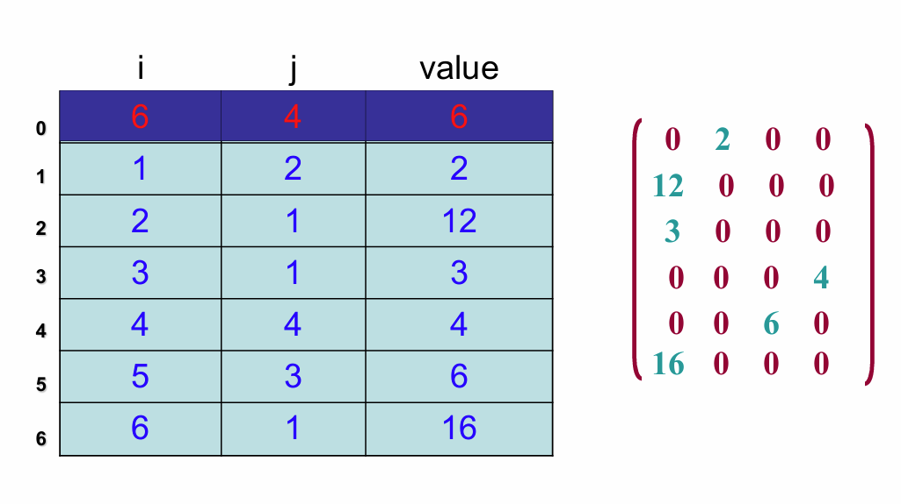
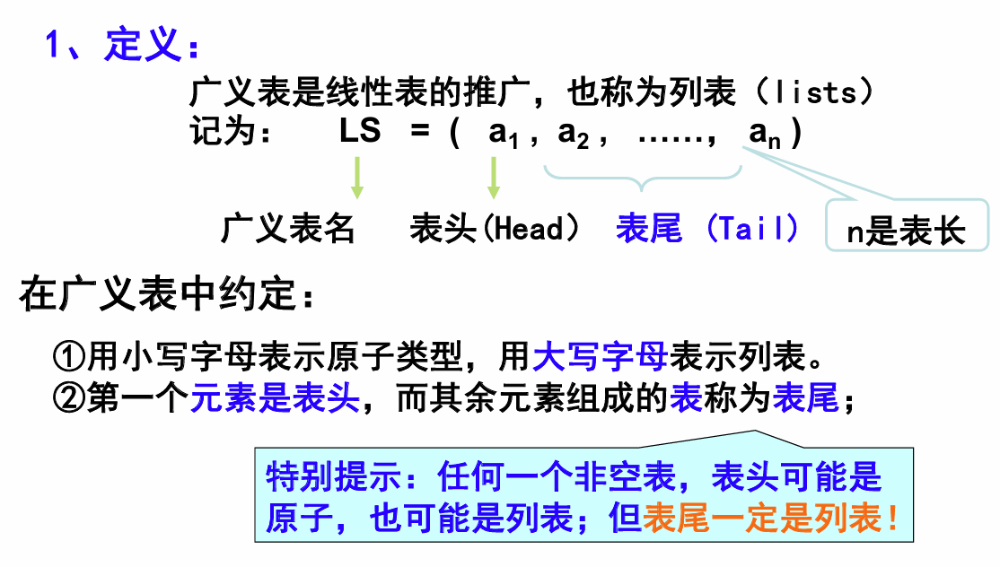
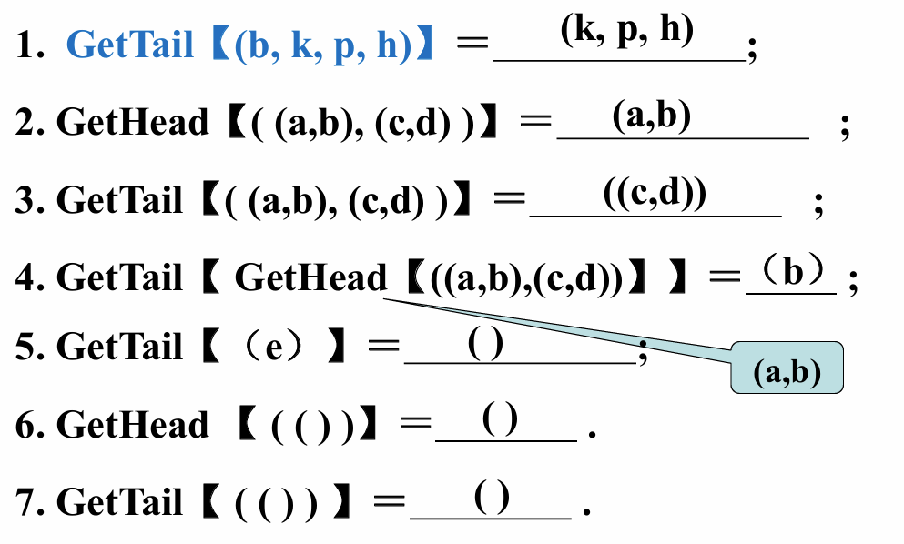
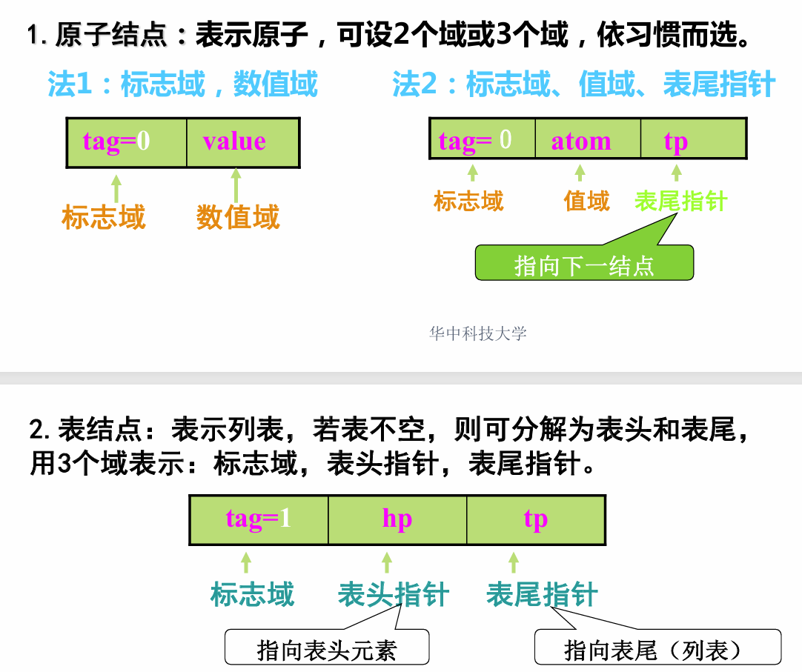
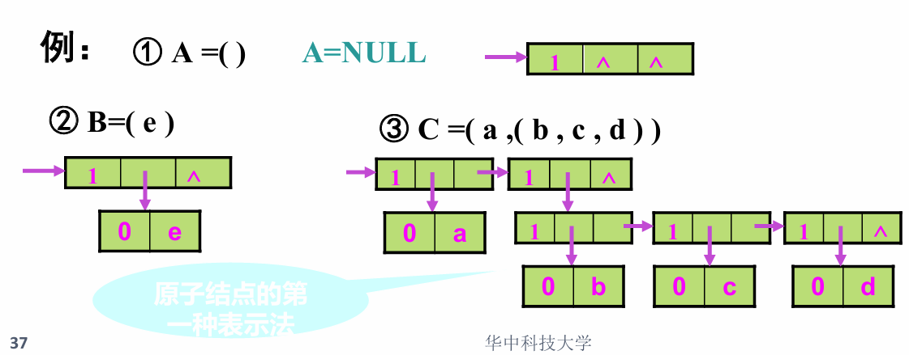

# 数组

## 存储结构

~~~c
typedef struct {
    ElemType *base;	// 数组元素基址
    int dim;
    int *bound;		// 数组各维长度信息保存区基址
    int *constants;	// 数组映像函数常量的基址
}Array;
~~~

$$
\begin{equation}
\begin{aligned}
\text{LOC}(j_1, j_2, \ldots, j_n) &= \text{LOC}(0, 0, \ldots, 0) + \sum_{i=1}^{n} c_i j_i \\
\text{其中 } & c_n = L, \quad c_{i-1} = b_i \times c_i, \quad 1 < i \leq n, b_i为各维长度，L为每个数组元素所占存储单元.
\end{aligned}
\end{equation}
$$

## 稀疏矩阵的三元组表示

### 十字链表表示

### 三元组表示

#### 普通版

#### 带辅助向量

#### 快速转置

~~~C
Status FastTransposeSMatrix (TSMatrix M, TSMatrix &T)
{
    // M是顺序存储的三元组表，求M的转置矩阵T
    T.mu = M.nu;
    T.nu = M.mu; 
    T.tu = M.tu;
    
    if (T.tu) {
        for (col = 1; col <= M.nu; col++) 
            num[col] = 0;   // 先清0，再统计每列非零元素个数
        
        for (t = 1; t <= M.tu; t++) { 
            col = M.data[t].j; 
            ++num[col]; 
        }
        
        cpos[1] = 1;
        
        for (col = 2; col <= M.nu; col++) 
            cpos[col] = cpos[col-1] + num[col-1]; // 再生成每列首元位置辅助向量
        
        for (p = 1; p <= M.tu; p++) { // p指向M.data，循环次数为非零元素总个数tu
            col = M.data[p].j;
            q = cpos[col]; // 查辅助向量得q，即T中位置
            T.data[q].i = M.data[p].j;
            T.data[q].j = M.data[p].i;
            T.data[q].value = M.data[p].value;
            ++cpos[col];
        }
    }
    return OK;
}
// FastTransposeSMatix
~~~

- 传统转置：$O(mu\times nu)$
- 压缩转置：$O(mu\times tu)$
- 压缩快速转置：$O(nu+tu)$

# 广义表

## 定义

## 存储结构

