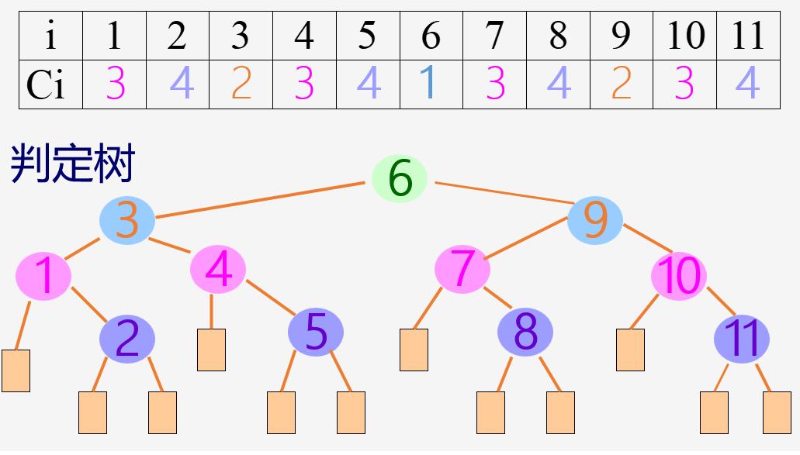
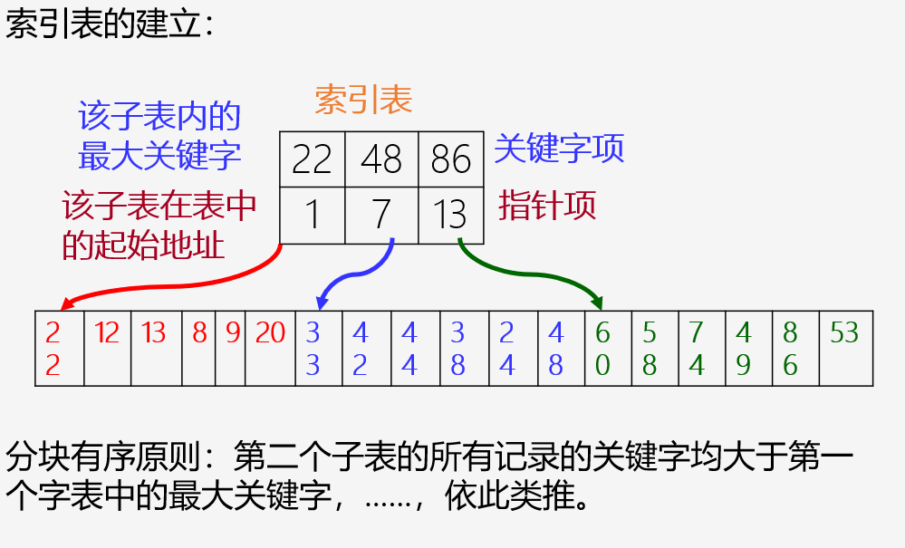
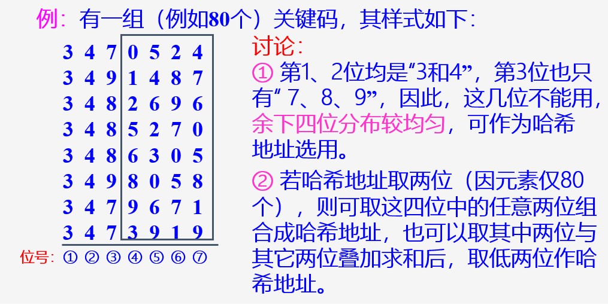
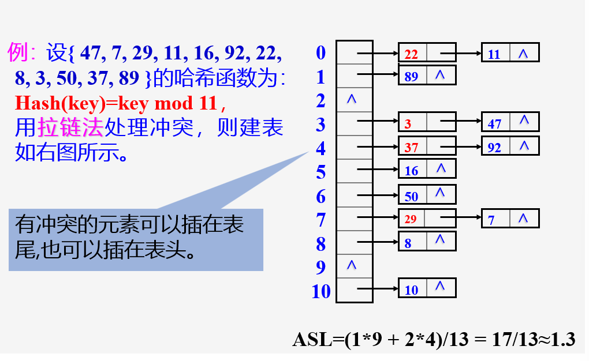

## 基本概念

- 1. 关键字
- 2. 搜索结构: 用于搜索的数据集合
- 3. 衡量搜索算法时间效率的标准: 搜索过程中关键字的平均比较次数, 即Average Search Length(ASL)

## 静态查找表

### 存储结构

~~~C
typedef struct {
	// 数据元素存储空间基址
	int length; // 0号单元留空
} SSTable;

typedef struct {
	keyType key;
	......
} ElemType;
~~~

### Sequential Search Table

```c
int Search_Seq(SSTable ST, KeyType key)
{
    // 在顺序表ST中顺序查找其关键字等于
    // key的数据元素。若找到，则函数值为
    // 该元素在表中的位置，否则为0
    ST.elem[0].key = key;      // “哨兵”
    for (int i=ST.length; ST.elem[i].key!=key; --i);
    
    return i;                  // 找不到时，i为0
} // Search_Seq
```

- **平均比较次数**  
  $$
  \frac{(1 + 2 + 3 + \dots + n-1 + n)}{n} = \frac{n+1}{2}
  $$

### 折半查找

- 前提: 有序表(从小到大排好序)

- 采用折半查找时，先求位于查找区间正中的对象的下标 \( mid \)，用其关键码与给定值 \( x \) 比较：
  - \( Elem[mid].key = x \)，查找成功；
  - \( Elem[mid].key > x \)，把查找区间缩小到表的 **前半部分**，再继续进行折半查找；
  - \( Elem[mid].key < x \)，把查找区间缩小到表的 **后半部分**，再继续进行折半查找。
  
- 每比较一次，查找区间缩小一半。如果查找区间已缩小到一个对象，仍未找到想要查找的对象，则查找失败。

~~~C
int Search_Bin(SSTable ST, KeyType key) {
    int low = 1;           
    int high = ST.length;  
    int mid;

    while (low <= high) {  
        mid = (low + high) / 2;
        
        if (key == ST.elem[mid].key)
            return mid;    // 找到待查元素
        else if (key < ST.elem[mid].key)
            high = mid - 1; // 继续在前半区间进行查找
        else
            low = mid + 1; // 继续在后半区间进行查找
    }
    
    return 0; // 顺序表中不存在待查元素
}
~~~

- 判定树


- 一般情况下，表长为 $ n $ 的折半查找的判定树的深度和含有 $ n $ 个结点的完全二叉树的深度相同。

- 在有序表中查找记录的过程就是走了一条从根结点到与该记录相应的结点的路径，和给定值进行的比较次数就是该结点在判定树上的层数次。

- 折半查找在查找成功时关键字比较次数不超过树的深度，即： $\text{lower}(\log_2 n + 1)$

### 分块查找



- 1) 由索引确定记录所在块（子表）；
- 2) 在顺序表的某个块内进行顺序查找。

- 可见，索引顺序查找的过程也是一个“缩小区间”的查找过程

- 索引顺序查找的平均查找长度 = 查找“索引”的平均查找长度 + 查找“顺序表”的平均查找长度

### 静态树表的查找

#### 静态最优查找树

假设有序表中含 5 个记录，并且已知各记录的查找概率不等，分别为 $p_1 = 0.1$, $p_2 = 0.2$, $p_3 = 0.1$, $p_4 = 0.4$ 和 $p_5 = 0.2$。则对此有序表进行折半查找，查找成功时的平均查找长度为

$$
\sum_{i=1}^{5} P_i C_i = 0.1 \times 2 + 0.2 \times 3 + 0.1 \times 1 + 0.4 \times 2 + 0.2 \times 3 = 2.3
$$

但是，如果在查找时令给定值先和第 4 个记录的关键字进行比较，比较不相等时再继续在左子序列或右子序列中进行折半查找，则查找成功时的平均查找长度为

$$
\sum_{i=1}^{5} P_i C_i = 0.1 \times 3 + 0.2 \times 2 + 0.1 \times 3 + 0.4 \times 1 + 0.2 \times 2 = 1.8
$$

这就说明，当有序表中各记录的查找概率不等时，按上图所示判定树进行折半查找，其性能未必是最优的。

如果只考虑查找成功的情况，则使查找性能达最佳的判定树是其带权内路径长度之和 

$$
PH = \sum_{i=1}^{n} w_i h_i
$$

取最小值的二叉树。其中：$n$ 为二叉树上结点的个数（即有序表的长度）；$h_i$ 为第 $i$ 个结点在二叉树上的层数次；结点的权 $w_i = c p_i (i = 1, 2, \cdots, n)$，其中 $p_i$ 为结点的查找概率，$c$ 为某个常量。称 $PH$ 值取最小的二叉树为静态最优查找树（Static Optimal Search Tree）。

#### 次优查找树

已知一个按关键字有序的记录序列
$$
(r_1, r_{l+1}, \cdots, r_h)
$$

其中

$$
r_1.key < r_{l+1}.key < \cdots < r_h.key
$$

与每个记录相应的权值为

$$
w_l, w_{l+1}, \cdots, w_h
$$

现构造一棵二叉树，使这棵二叉树的带权内路径长度 $PH$ 值在所有具有同样权值的二叉树中近似为最小，称这类二叉树为次优查找树（Nearly Optimal Search Tree）。

构造次优查找树的方法是：首先在记录序列中取第 $i (l \leq i \leq h)$ 个记录构造根结点 $r_i$，使得

$$
\Delta P_i = \left| \sum_{j=i+1}^{h} w_j - \sum_{j=l}^{i-1} w_j \right|
$$

取最小值 $\Delta P_i = \min_{l \leq j \leq h} \{\Delta P_j\}$，然后分别对子序列 $\{r_l, r_{l+1}, \cdots, r_{i-1}\}$ 和 $\{r_{i+1}, \cdots, r_h\}$ 构造两棵次优查找树，并分别设为根结点 $r_i$ 的左子树和右子树。

为便于计算 $\Delta P_i$，引入累计权值和

$$
sw_i = \sum_{j=l}^{i} w_j
$$

并设 $w_{l-1} = 0$ 和 $sw_{l-1} = 0$，则

$$
\begin{cases}
sw_{i-1} - sw_{l-1} = \sum_{j=l}^{i-1} w_j \\
sw_h - sw_i = \sum_{j=i+1}^{h} w_j
\end{cases}
$$

$$
\Delta P_i = |(sw_h - sw_i) - (sw_{i-1} - sw_{l-1})|
$$

$$
= |(sw_h + sw_{l-1}) - sw_i - sw_{i-1}|
$$

##### 实现代码

```c
void SecondOptimal(BiTree &T, ElemType R[], float sw[], int low, int high) {
    // 由有序表 R[low..high] 及其累积权值表 sw（其中 sw[0] == 0）递归构造次优查找树 T。
    i = low; 
    min = abs(sw[high] - sw[low]); // abs表示绝对值
    dw = sw[high] + sw[low - 1]; 

    for (j = low + 1; j <= high; ++j) { 
        if (abs(dw - sw[j] - sw[j - 1]) < min) { 
            i = j; 
            min = abs(dw - sw[j] - sw[j - 1]); 
        } 
    }

    T = (BiTree)malloc(sizeof(BiTNode)); 
    T->data = R[i]; 
    // 生成结点

    if (i == low) 
        T->lchild = NULL; 
    else 
        SecondOptimal(T->lchild, R, sw, low, i - 1); 
    // 构造左子树

    if (i == high) 
        T->rchild = NULL; 
    else 
        SecondOptimal(T->rchild, R, sw, i + 1, high); 
    // 构造右子树
} // SecondOptimal
```

## 动态查找表

- 表的结构是在查找过程中动态生成的(插入操作)

### 二叉排序(查找)树

- 性质: 若它的左子树不空，则左子树上所有结点的值均小于根结点的值; 若它的右子树不空，则右子树上所有结点的值均大于根结点的值; 它的左、右子树也都分别是二叉排序树

- 算法实现-search

~~~C
Status SearchBST(BiTree T, KeyType key, BiTree f, BiTree &p)
{
    // 查找成功则p指向该数据元素结点并返回TRU，否则p指向查找路径上访问的最后一个结点，并返回 FALSE，f指向T的根结点
    if (!T)
    {
        p = f;
        return FALSE;  // 查找不成功
    }
    else if (EQ(key, T->data.key))
    {
        p = T;
        return TRUE;  // 查找成功
    }
    else if (LT(key, T->data.key))
    {
        SearchBST(T->lchild, key, T, p);  // 在左子树中继续查找
    }
    else
    {
        SearchBST(T->rchild, key, T, p);  // 在右子树中继续查找
    }
}

~~~

- 算法实现-insert

~~~C
Status InsertBST(BiTree &T, ElemType e)
{
    // 当二叉排序树中不存在关键字等于e.key的数据元素时，插入元素值为e的结点，并返回TRUE；否则，不进行插入并返回 FALSE
    if (!SearchBST(T, e.key, NULL, p))  // 查找不成功，插入结点
    {
        s = (BiTree) malloc(sizeof(BiTNode));  // 为新结点分配空间
        s->data = e;
        s->lchild = NULL;
        s->rchild = NULL;

        if (!p) 	// 树为空数
            T = s;  // 插入 s 为新的根结点
        else if (LT(e.key, p->data.key))
            p->lchild = s;  // 插入 *s 为 *p 的左孩子
        else 
            p->rchild = s;  // 插入 *s 为 *p 的右孩子

        return TRUE;  // 插入成功
    }
    else 
        return FALSE;
} // Insert BST
~~~

- 同样的数据，输入顺序不同，建立起来的二叉搜索树的形态也不同。这直接影响到二叉搜索树的搜索性能。如果输入序列选得不好，会建立起一棵单支树，使得二叉搜索树的高度达到最大，这样必然会降低搜索性能。

- 算法实现-delete

- 待删除结点既有左子树又有右子树:希望删除p后，其它元素的相对位置不变。有两种方案：

    - 法1：令\*p的左子树为\*f的左子树，\*p的右子树接为\*s的右子树； //即 $f_L=P_L$; $S_R=P_R$;
    - 法2：直接令\*s代替\*p  // \*s为\*p左子树最右下方的结点

~~~C
Status DeleteBST(BiTree &T, KeyType key)
{
    // 若二叉排序树 T 中存在其关键字等于 key 的数据元素，则删除该数据元素结点，并返回函数值 TRUE，否则返回函数值 FALSE
    if (!T) 
        return FALSE;  // 空树
    else {
        if (EQ(key, T->data.key)) {
            Delete(T);  // 找到关键字等于key的数据元素
            return TRUE;
        }
        else if (LT(key, T->data.key)) {
            DeleteBST(T->lchild, key);  // 继续在左子树中进行查找
        }
        else {
            DeleteBST(T->rchild, key);  // 继续在右子树中进行查找
        }
    }
} // DeleteBST

void Delete(BiTree &p)
{
    // 从二叉排序树中删除结点 p，并重接它的左子树或右子树
    if (!p->rchild) {  // 右子树为空树只需重接它的左子树
        q = p;
        p = p->rchild;
        free(q);
    }
    else if (!p->lchild) {  // 左子树为空树只需重接它的子树
        q = p;
        p = p->lchild;
        free(q);
    }
    else {  // 左右子树均不空
        q = p;
        s = p->lchild;
        // 转左，然后向右走向尽头，s 指向被删结点的前驱
        while (s->rchild) {
            q = s;
            s = s->rchild;
        }
        p->data = s->data;
        /* 如果当前结点 p 的左右子树均不为空：找到 p 的中序前驱 （即 p 的左子树中最右边的结点，也就是左子树中的最大值结点）. 将 s 的值复制到 p 中，这样就用 s 的值替代了 p 的值。*/
		/*删除结点 s：如果 q 不等于 p，说明 s 是 q 的右子结点，将 q 的右子树指向 s 的左子树。如果 q 等于 p，说明 s 是 p 的左子结点，将 q 的左子树指向 s 的左子树 */ 
        if (q != p)
            q->rchild = s->lchild;
        else 
            q->lchild = s->lchild;
        free(s);
    }
}
~~~

### 二叉平衡树

- 定义: 一棵AVL树或者是空树，或者是具有下列性质的二叉搜索树：它的左子树和右子树都是AVL树，且左子树和右子树的高度之差的绝对值不超过1
- 结点平衡因子(balance factor): 该节点左子树的高度减去右子树的高度, 对AVL树可取-1, 0, 1
- 二叉平衡树的高度通常为$\log_2(n)$

## 哈希查找表

### 基本概念

- 哈希表: 散列存储结构
- 基本思想: 建立关键字与存储地址的关系
- 时间复杂度: O(1)

### 几种构造哈希函数的方法

#### 直接定址法

- $\text{Hash(key)} = a \cdot \text{key} + b$ 
- 优点：以关键码key的某个线性函数值为哈希地址，不会产生冲突。

#### 除留余数法

- 哈希函数公式：
  $$
  \text{Hash(key)} = \text{key} \bmod p \quad (p \text{ 是一个整数})
  $$

- 若设计的哈希表长为 $ m $，则一般取 $ p \leq m $ 且为质数（也可以是合数，但不能包含小于 20 的质因子）

#### 数学分析法

- 选用关键字的某几位组合成哈希地址
- 选用原则: 各种符号在该位上出现的频率大致相同



#### 平方取中法

- 特点：对关键码平方后，按哈希表大小，取中间的若干位作为哈希地址。
- 理由：因为中间几位与数据的每一位都相关。
- 例：2589 的平方值为 6702921，可以取中间的 029 为地址。

#### 折叠法

- 特点：将关键码自左到右分成位数相等的几部分（最后一部分位数可以短些），然后将这几部分叠加求和，并按哈希表表长，取后几位作为哈希地址。
- 适用：每一位上各符号出现概率大致相同的情况。
- 法1：移位法 —— 将各部分的最后一位对齐相加。
- 法2：间界叠加法 —— 从一端向另一端沿分割界来回折叠后，最后一位对齐相加。
- 例：
  - 元素 42751896，用法1：$ 427 + 518 + 96 = 1041 $
  - 用法2：$ 427 \, 518 \, 96 \rightarrow 724 + 518 + 69 = 1311 $

#### 随机数法

$$
\text{Hash(key)} = \text{random(key)} \quad (\text{random为伪随机函数})
$$

### 冲突处理方法

#### 开放地址法

- 设计思路：有冲突时就去寻找下一个空的哈希地址，只要哈希表足够大，空的哈希地址总能找到，并将数据元素存入。

##### 线性探测法
$$
H_i = (\text{Hash(key)} + d_i) \mod m \quad (1 \leq i < m)
$$
其中：
- $m$ 为哈希表长度。
- $d_i$ 为增量序列 $1, 2, \dots, m-1$，且 $d_i = i$。

- 缺点: 可能使第 $i$ 个哈希地址的同义词存入第 $i+1$ 个哈希地址，这样本应存入第 $i+1$ 个哈希地址的元素变成了第 $i+2$ 个哈希地址的同义词，因此，可能出现很多元素在相邻的哈希地址上“堆积”起来，大大降低了查找效率。

##### 二次探测法

- $d_i$ 为增量序列：$1^2, -1^2, 2^2, -2^2, \dots, q^2$。

##### 伪随机数法

- $d_i$为伪随机数序列

#### 链地址法(拉链法)

- 基本思想：将具有相同哈希地址的记录链成一个单链表，m个哈希地址就设m个单链表，然后用一个数组将m个单链表的表头指针存储起来，形成一个动态的结构

- 算法实现

~~~C
typedef LNode* CHashTable[MAXSIZE];  // CHashTable为指针数组

Status Build_Hash(CHashTable T, int m)
{
    if (m < 1) 
        return ERROR;  
    
    // 哈希表初始化
    T = (LNode**)malloc(m * sizeof(LNode*));  
    for (int i = 0; i < m; i++)
        T[i] = NULL;  

    while ((key = getchar()) != NULL)  
    {
        q = (LNode*)malloc(sizeof(LNode));  // 分配新节点空间
        q->data = key; 
        q->next = NULL;  
        n = Hash(key);  // 计算哈希地址
        
        if (!T[n]) 
            T[n] = q;  // 若无冲突，则作为链表的第一个结点
        else {
            for (p = T[n]; p->next != NULL; p = p->next);  // 找到链表尾部
            p->next = q;  // 有冲突则插入链表尾部
        }
    }
    return OK;
}// Build_Hash
~~~



####  再哈希法(双哈希函数法)

$$
H_i = RH_i(\text{key}) \quad i = 1, 2, \dots, k
$$

- $ RH_i $ 均是不同的哈希函数。
- 当产生冲突时，就计算另一个哈希函数，直到冲突不再发生。

#### 建立一个公共溢出区

- 思路：除设立哈希基本表外，另设立一个溢出向量表。

- 所有关键字和基本表中关键字为同义词的记录，不管它们由哈希函数得到的地址是什么，一旦发生冲突，都填入溢出表。

### 哈希表的查找与分析

- 存储结构

~~~C
int hashsize[] = { ... }; // 哈希表容量数组，存储多个候选容量值

typedef struct {
    ElemType *elem; // 数据元素存储基址，动态分配数组
    int count;      // 当前数据元素个数
    int sizeindex;  // 当前使用的容量索引，hashsize[sizeindex] 表示当前哈希表的容量
} HashTable;
~~~

- search

~~~C
Status SearchHash(HashTable H, KeyType K, int &p, int &c) {
    // 在开放定址哈希表 H 中查找关键码为 K 的记录。若查找成功，以 p 指示待查数据在表中的位置；否则，以 p 指示插入位置
    p = Hash(K);          // 求得哈希地址
    while (H.elem[p].key != NULLKEY && !EQ(K, H.elem[p].key)) {
        collision(p, ++c); // 求得下一探查地址 p
    }
    if (EQ(K, H.elem[p].key)) 
        return SUCCESS; // 查找成功，返回待查数据元素位置 p
    else 
        return UNSUCCESS;                  // 查找不成功
} // SearchHash
~~~

- insert

~~~C
Status InsertHash(HashTable &H, ElemType e) {
    c = 0; // c表示冲突次数
    
    // 表中已有与 e 有相同关键字的元素
    if (HashSearch(H, e.key, p, c) == SUCCESS)
        return DUPLICATE;
    // 冲突次数 c 未达到上限（阀值 c 可调）
    else if (c < hashsize[H.sizeindex] / 2) {
        H.elem[p] = e; 
        ++H.count; 
        return OK; 
    } else {
        RecreateHashTable(H);               // 重建哈希表
    }
} // InsertHash
~~~

- 装填因子: 
    $$
    \alpha = \frac{\text{表中填入的记录数}}{\text{哈希表的长度}}
    $$


- $\alpha$越大, 发生冲突可能性越大, 查找时比较次数越多

$$
\text{ASL} \approx 1 + \frac{\alpha}{2} \quad \text{(拉链法)}
$$

$$
\text{ASL} \approx \frac{1}{2} \left( 1 + \frac{1}{1 - \alpha} \right) \quad \text{(线性探测法)}
$$

$$
\text{ASL} \approx -\frac{1}{\alpha} \ln(1 - \alpha) \quad \text{(随机探测法)}
$$

