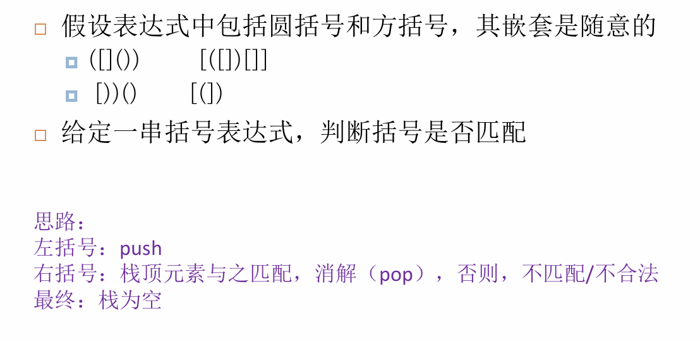
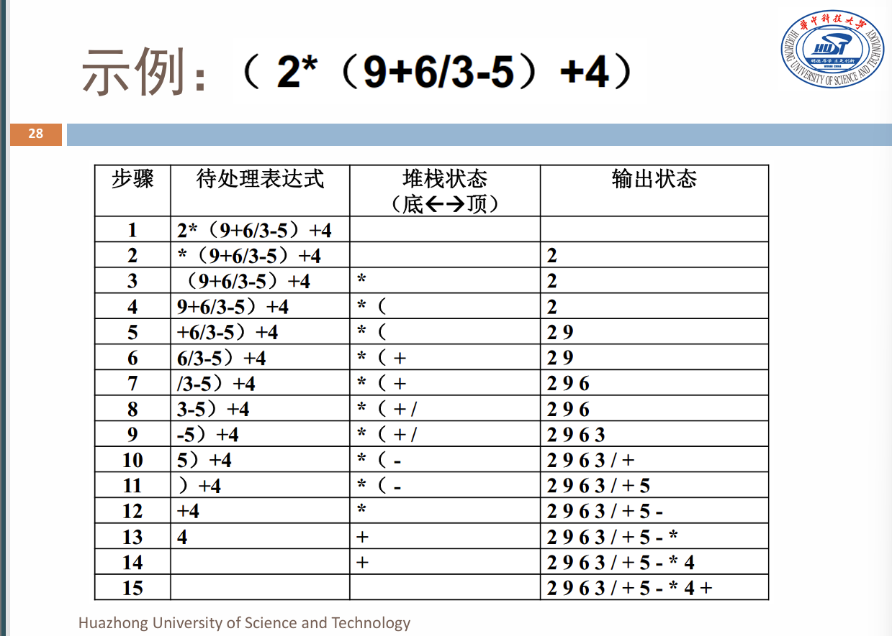
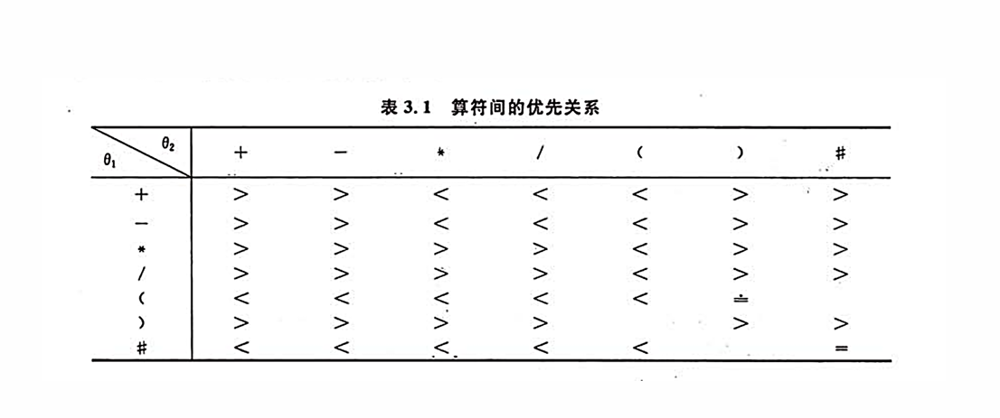
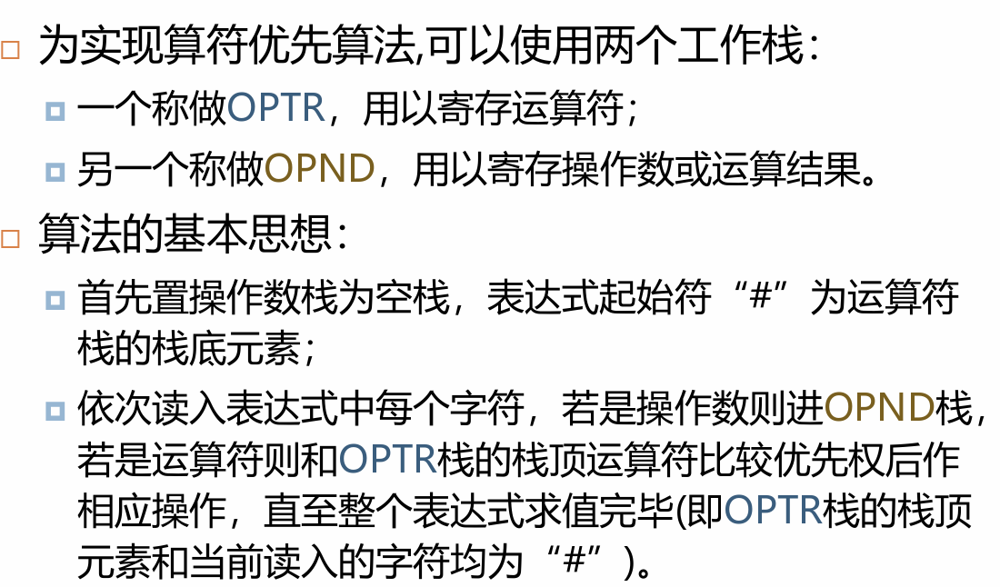
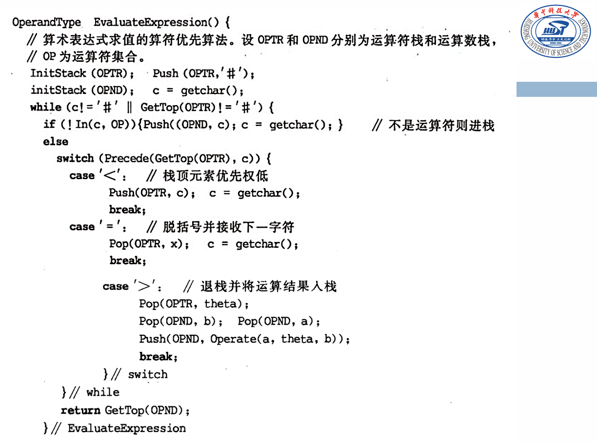
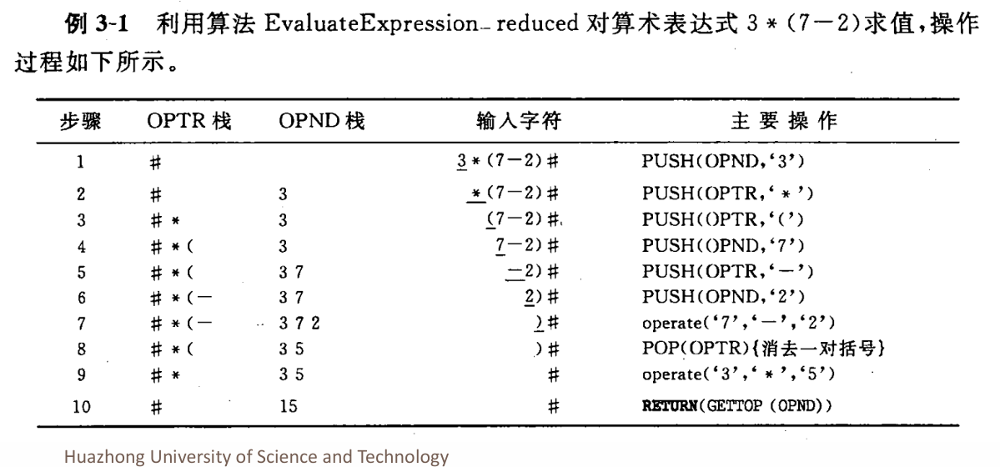
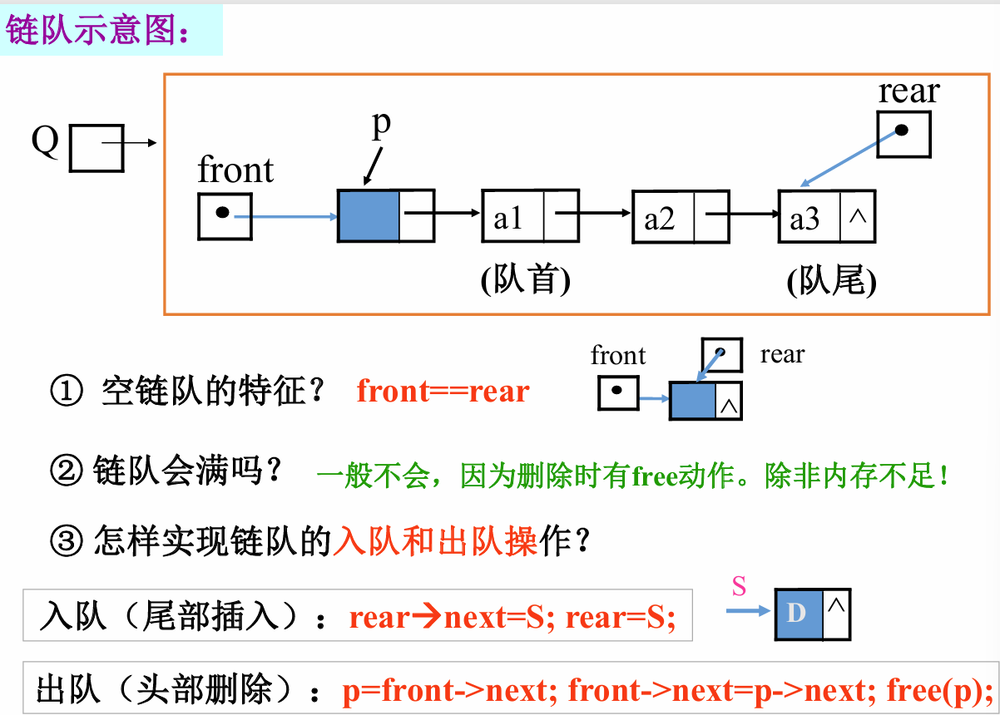
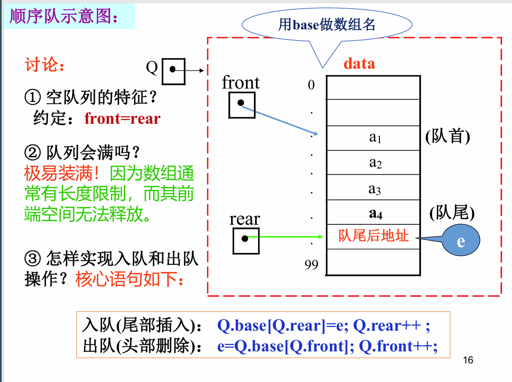
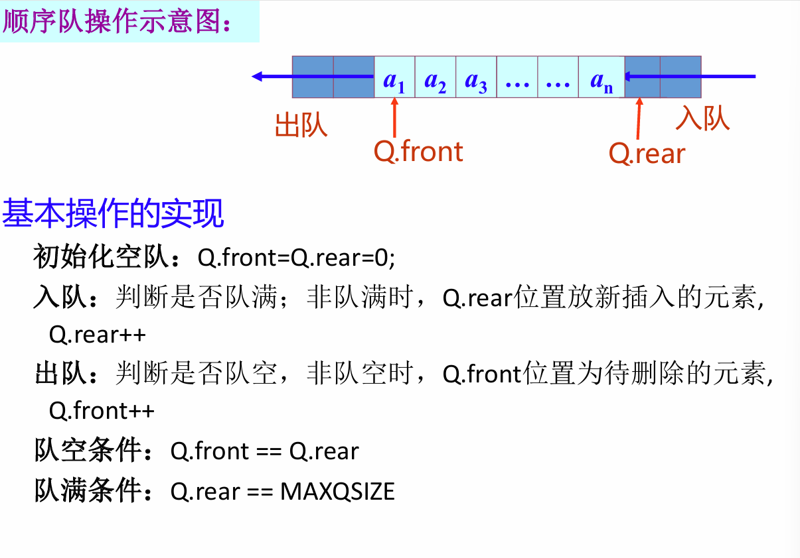
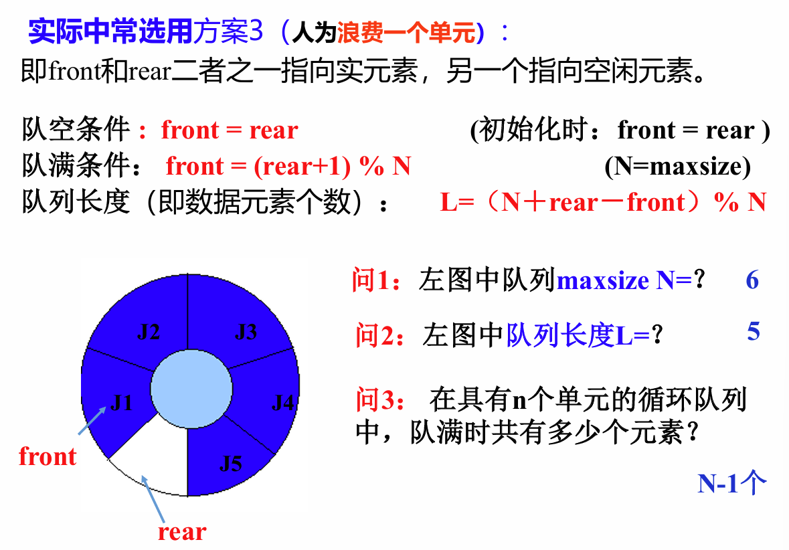

# 栈

- LIFO

## 存储结构与基本操作

~~~C
#define MaxSize // 储存数据元素的最大个数
typedef struct SNode *Stack;
struct SNode {
    ElementType data[MaxSize];
    int top;	// 栈顶元素位置
};

void push(Stack ptrS, ElementType item) {
    if (ptrS->Top == MaxSize - 1) {
        printf("栈满");
    	exit(1);
    } 
    else {
        ptrS->data[++(ptrS->top)] = item;
    }
}

ElementType pop(Stack ptrS) {
    if (ptrS->top == -1) {
        printf("栈空");
        exit(1);
    } else {
        return (ptrS->data[(ptrS->top)--]);
    }
}
~~~

## 双向栈

~~~C
#define MaxSize // 存储数据元素的最大个数
struct DStack {
    ElementType Data[MaxSize];
    int Top1;  // 堆栈 1 的栈顶指针 
    int Top2;  // 堆栈 2 的栈顶指针 
} S;
S.Top1 = -1;
S.Top2 = MaxSize;

// 栈满条件：top1 + 1 = top2
~~~

## 链式存储实现

~~~C
typedef struct SNode *Stack;
struct SNode {
    ElementType Data;
    struct SNode *Next;
};

Stack CreateStack()
{
    /* 构建一个堆栈的头结点，返回指针 */
    Stack S;
    S = (Stack)malloc(sizeof(struct SNode));
    S->Next = NULL;
    return S;
}

int IsEmpty(Stack S)
{
    /* 判断堆栈S是否为空，若为空函数返回整数1，否则返回0 */
    return (S->Next == NULL);
}

void Push(ElementType item, Stack S)
{
    /* 将元素item压入堆栈S */
    struct SNode *TmpCell;
    TmpCell = (struct SNode *)malloc(sizeof(struct SNode));
    TmpCell->Element = item;
    TmpCell->Next = S->Next;
    S->Next = TmpCell;
}

ElementType Pop(Stack S)
{
    /* 删除并返回堆栈S的栈顶元素 */
    struct SNode *FirstCell;
    ElementType TopElem;
    if (IsEmpty(S)) {
        printf("栈空");
        return NULL;
    } else {
        FirstCell = S->Next;
        S->Next = FirstCell->Next;
        TopElem = FirstCell->Element;
        free(FirstCell);
        return TopElem;
    }
}
~~~

## 栈的应用

### 行编辑程序

~~~C
void LineEdit()
{
    // 利用字符栈 S，从终端接收一行并传送至调用过程的数据区。
    InitStack(S);   // 构造空栈 S
    ch = getchar(); // 从终端接收第一个字符
    while (ch != EOF)
    { 
        while (ch != EOF && ch != '\n')
        {
            switch (ch)
            {
            case '#':
                Pop(S, c);
                break; // 仅当栈非空时退栈
            case '@':
                ClearStack(S);
                break; // 重置 S 为空栈
            default:
                Push(S, ch);
                break; // 有效字符进栈，未考虑栈满情形
            }
            ch = getchar(); // 从终端接收下一个字符
        }
        将从栈底到栈顶的栈内字符传送至调用过程的数据区；
        ClearStack(S); // 重置 S 为空栈
        if (ch != EOF)
            ch = getchar();
    }
    
    DestroyStack(S);
}
~~~

### 括号匹配的检验

### 表达式求值

# 队列

## 基本概念

- FIFO
- 队首：front
- 队尾：rear

## 基本操作

~~~C
enQueue(&Q, e)
deQueue(&Q, &e)
~~~

## 链队列

### 存储结构

~~~C
typedef Struct QNode {
    QElemType data;       // 元素
    Struct QNode *next;   // 指向下一结点的指针
} QNode, *QueuePtr;

typedef struct {
    QueuePtr front;  // 队首指针
    QueuePtr rear;   // 队尾指针
} LinkQueue;
~~~

- 注意出队操作时判断是否只有一个结点

## 顺序队列

### 存储结构

~~~C
#define MAXQSIZE 100  // 最大队列长度

typedef struct {
    QElemType *base;   // 队列的基址
    int front;         // 队首指针，若队列不为空，指向队列头元素
    int rear;          // 队尾指针，若队列不为空，指向队列尾元素的下一个位置
} SqQueue;

Q.base = (QElemType *) malloc(sizeof(QElemType) * MAXQSIZE);
~~~

## 循环队列

### 基本操作

~~~c
Q.rear = (Q.rear + 1) % MAXQSIZE	// 入队
Q.front = (Q.front + 1) % MAXQSIZE	// 出队
    
Q.front == Q.rear	// 队空条件，原因：由于出队，Q.front 追上了 Q.rear。
Q.front == Q.rear	// 队满条件：原因：由于入队，Q.rear 追上了 Q.front。
~~~

### 改进

