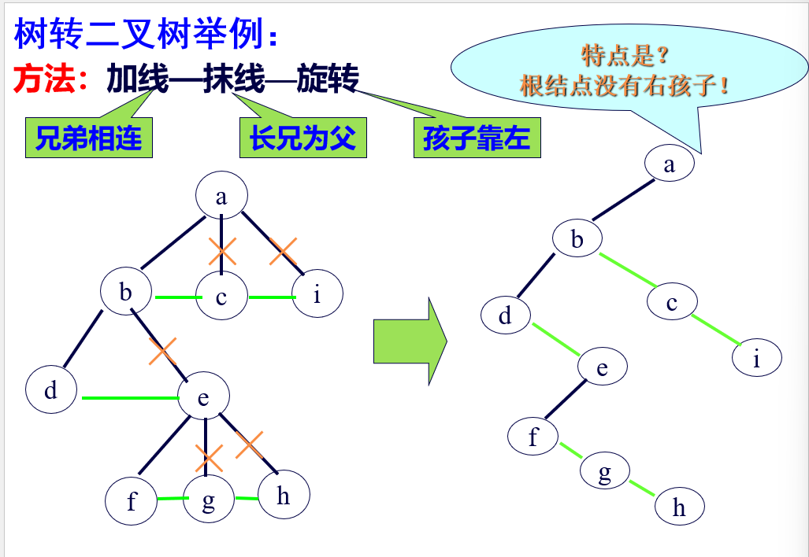
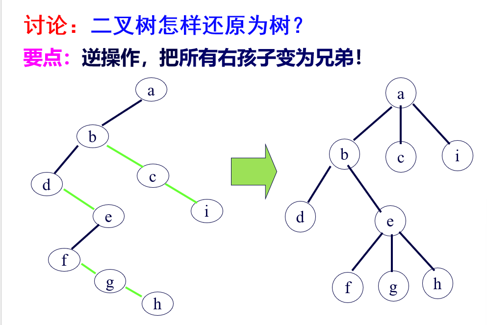
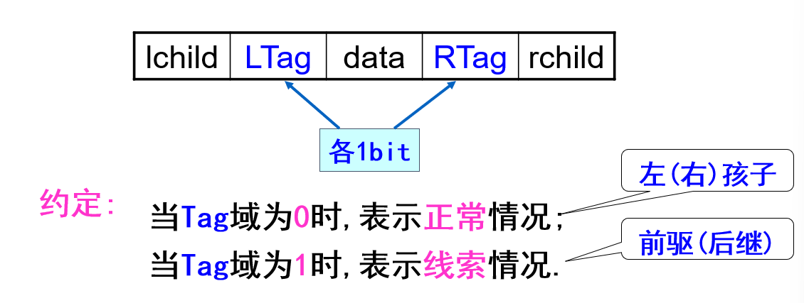
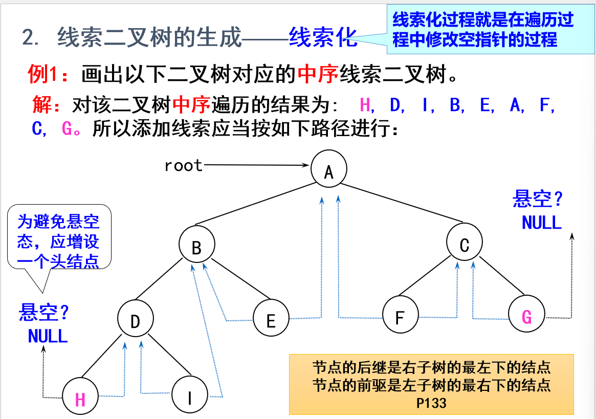
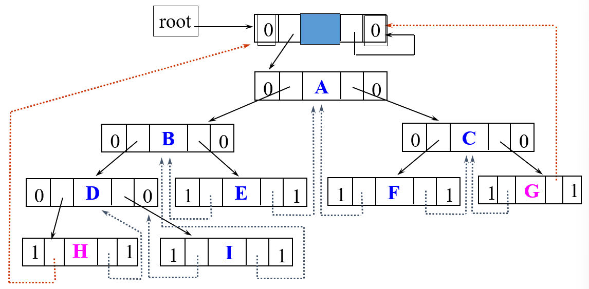
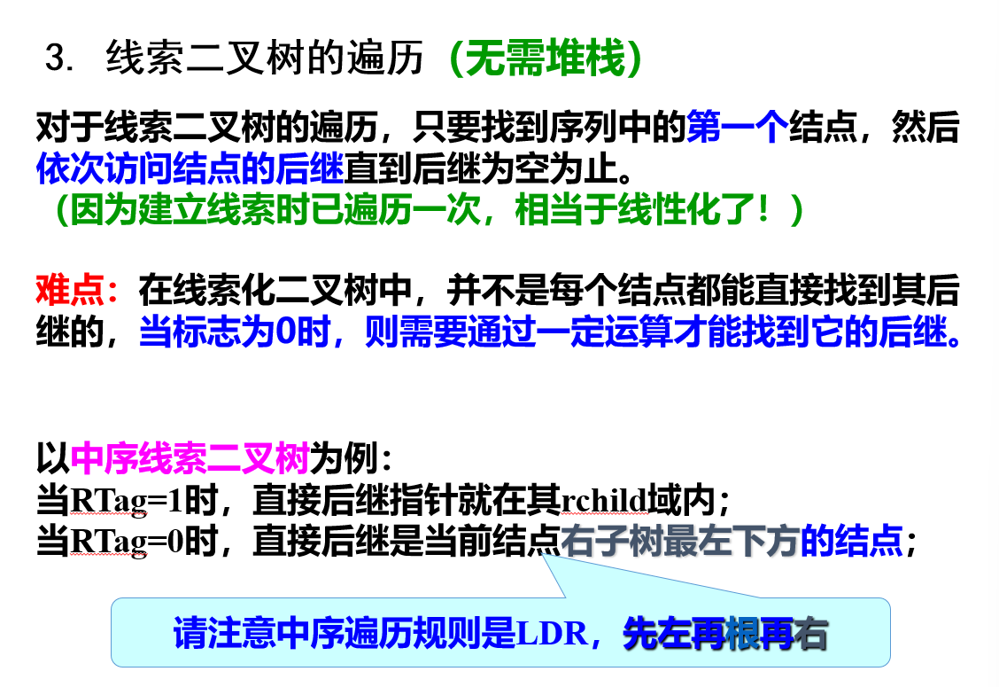
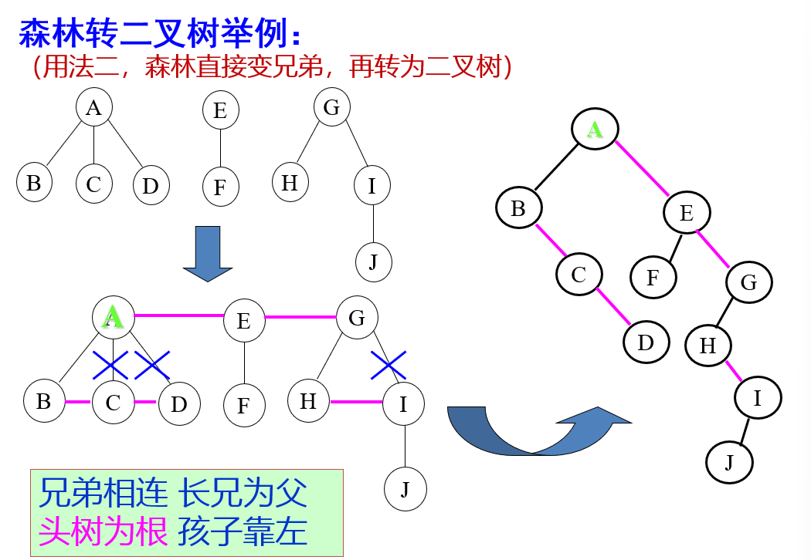
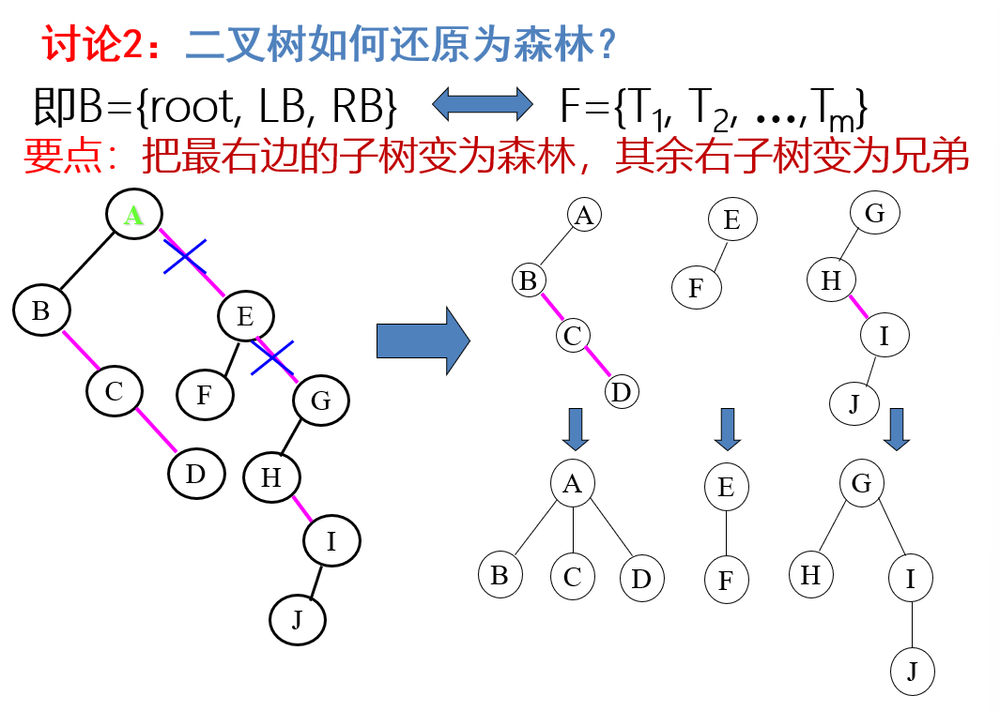

# 树

## 基本概念

| 术语               | 定义                                                   |
| ------------------ | ------------------------------------------------------ |
| 根                 | 即根结点（没有前驱）                                   |
| 叶子               | 即终端结点（没有后继）                                 |
| 森林               | 指 m 棵不相交的树的集合                                |
| 有序树             | 结点各子树从左至右有序，不能互换（左为第一）           |
| 无序树             | 结点各子树可互换位置                                   |
| 双亲               | 即上层的那个结点（直接前驱）                           |
| 孩子               | 即下层结点的子树的根（直接后继）                       |
| 兄弟               | 同一双亲下的同层结点（孩子之间互称兄弟）               |
| 结点               | 即树的数据元素                                         |
| 结点的度           | 结点挂接的子树数（有几个直接后继就是几度，亦称“次数”） |
| 结点的层次         | 从根到该结点的层数（***根结点算第一层***）             |
| 终端结点           | 即度为 0 的结点，即叶子                                |
| 分支结点           | 即度不为 0 的结点（也称为内部结点）                    |
| 树的度             | 所有结点度中的最大值（$Max\{各结点的度\}$）            |
| 树的深度（或高度） | 指所有结点中最大的层数（$Max\{各结点的层次\}$}）       |

## 树的表示方法

- 将树用二叉树表示

## 二叉树

### 性质

| 性质编号    | 性质描述                                                     |
| ----------- | ------------------------------------------------------------ |
| 性质1       | 在二叉树的第 $i$ 层上至多有 $2^{i-1}$ 个结点（$i > 0$）      |
| 性质2       | 深度为 $k$ 的二叉树至多有 $2^k - 1$ 个结点（$k > 0$）        |
| ***性质3*** | 对于任何一棵二叉树，若 2 度的结点数有 $n_2$ 个，则叶子数（$n_0$）必定为 $n_2 + 1$（即 $n_0 = n_2 + 1$） |
| 性质4       | 具有 $n$ 个结点的完全二叉树的深度必为 $\lfloor \log_2 n \rfloor + 1$ |
| 性质5       | 对完全二叉树，若从上至下、从左至右编号，则编号为 $i$ 的结点： |
|             | - 其左孩子编号必为 $2i$；                                    |
|             | - 其右孩子编号为 $2i + 1$；                                  |
|             | - 其双亲的编号必为 $i / 2$（$i = 1$ 时为根，除外）。         |

- 满二叉树与完全二叉树（$n_1\leqslant1$)

### 存储结构

#### 顺序存储结构

- 自上而下，从左至右编号
- 下标值为$i$的双亲，其左孩子的下标值必为$2i$，其右孩子的下标值必为$2i＋1$
- 一律转化为完全二叉树表示

#### 链式存储

~~~C
typedef struct TreeNode {
    int data;                   
    struct TreeNode *left;        // 左孩子
    struct TreeNode *right;       // 右孩子
} TreeNode;
~~~

### 遍历二叉树

#### 递归遍历

~~~C
void DLR(node *root) {
    if (root != NULL) { // 非空二叉树
        printf("%d ", root->data); // 访问根节点
        DLR(root->lchild); // 递归遍历左子树
        DLR(root->rchild); // 递归遍历右子树
    }
}// 先序遍历

void LDR(node *root) {
    if (root != NULL) {
        LDR(root->lchild); // 递归遍历左子树
        printf("%d ", root->data); // 访问根节点
        LDR(root->rchild); // 递归遍历右子树
    }
}// 中序遍历

void LRD(node *root) {
    if (root != NULL) {
        LRD(root->lchild); // 递归遍历左子树
        LRD(root->rchild); // 递归遍历右子树
        printf("%d ", root->data); // 访问根节点
    }
}// 后序遍历
~~~

#### 层次遍历

##### 中序遍历

~~~C
void InOrderTraversal(BinTree T)
{
    Stack S = CreateStack(MaxSize); /* 创建并初始化堆栈 S */
    
    while (T || !IsEmpty(S)) {
        while (T) {  /* 一直向左并将沿途结点压入堆栈 */
            Push(S, T);
            T = T->Left;
        }
        
        if (!IsEmpty(S)) {
            T = Pop(S);  /* 结点弹出堆栈 */
            printf("%d", T->Data);  /* 访问并打印结点 */
            T = T->Right;  /* 转向右子树 */
        }
    }
}
~~~

##### 先序遍历

~~~C
void PreOrderTraversal(BinTree T)
{
    Stack S = CreateStack(MaxSize); /* 创建并初始化堆栈 S */
    
    while (T || !IsEmpty(S)) {
        while (T) {  /* 一直向左并将沿途结点压入堆栈 */
            printf("%d", T->Data);  /* 访问并打印结点 */
            Push(S, T);
            T = T->Left;
        }
        
        if (!IsEmpty(S)) {
            T = Pop(S);  /* 结点弹出堆栈 */
            T = T->Right;  /* 转向右子树 */
        }
    }
}
~~~

### 通过先序/后序遍历结果和中序遍历结果恢复二叉树

#### 例题：已知一棵二叉树的中序序列和后序序列分别是 `BDCEAFHG` 和 `DECBHGFCA`，请画出这棵二叉树。

#### 分析：
1. **由后序遍历特征**：  
   - 根结点必在后序序列尾部（即 `A`）。

2. **由中序遍历特征**：  
   - 根结点必在其中间，而且其左部必全部是左子树的子孙（即 `BDCE`），其右部必全部是右子树的子孙（即 `FHG`）。

3. **进一步分析**：  
   - 根据后序中的 `DECB` 子串，可以确定 `B` 为 `A` 的左孩子。
   - 根据 `HGF` 子串，可以确定 `F` 为 `A` 的右孩子。
   - 以此类推，逐步构建整棵二叉树。

### 创建二叉树的算法

~~~C
void CreateBiTree( BiTree &T ){    //构造二叉树T
    scanf(&ch);
    if(ch == ' ')
        T=NULL; 
    else{
        if(!(T=( BiTNode*)malloc(sizeof(BiTNode))))
            exit(overflow);
        
        T->data=ch;                           
        T->lchild = CreateBiTree(T->lchild);   //构造左子树
        T->rchild = CreateBiTree(T->rchild);   //构造右子树
    } 
    
    return T;
} //CreateBiTree
~~~

### 线索二叉树（Threaded Binary Tree）

- 线索化过程就是在遍历过程中修改空指针的过程：
    将空的lchild改为结点的直接前驱；
    将空的rchild改为结点的直接后继。
    非空指针呢？仍然指向孩子结点（称为“正常情况”）

#### 线索二叉树的遍历

## 树和森林

### 森林与树的转换

### 树的存储方式

- 数组--存储双亲
- 孩子（可带双亲）链表
- 左孩子-右兄弟表示法

### 树和森林的遍历

#### 树的遍历

- 先根，后根（无中序遍历）
- 层次
- 树的先根遍历与二叉树的先序遍历相同；树的后根遍历相当于二叉树的中序遍历

#### 森林的遍历

- 先序遍历森林
    若森林非空，则可按下述规则遍历之：
    (1) 访问森林中第一棵树的根结点；
    (2) 先序遍历第一棵树中根结点的子树森林；
    (3) 先序遍历除去第一棵树之后剩余的树构成的森林。
- 中序遍历森林
    若森林非空，则可按下述规则遍历之：
    (1) 中序遍历除去第一棵树之后剩余的树构成的森林；
    (2) 访问第一棵树的根结点；
    (3) 中序遍历第一棵树中根结点的子树森林。
- 森林的先序/中序遍历结果与对应二叉树先序/中序遍历结果相同

### 二叉树的应用

- 二叉平衡树（AVL树）
- 二叉排序树

## Huffman树

### 基本概念

| 术语             | 定义                                          |
| ---------------- | --------------------------------------------- |
| 路径             | 由一结点到另一结点间的分支所构成。            |
| 路径长度         | 路径上的分支数目。                            |
| 树的路径长度     | 从树根到每一结点的路径长度之和。              |
| 带权路径长度     | 结点到根的路径长度与结点上权的乘积（$WPL$）。 |
| 树的带权路径长度 | 即树中所有叶子结点的带权路径长度之和。        |
| Huffman 树       | 带权路径长度最小的树。                        |

### 构造过程

- 见ppt

### Huffman编码

- 频度高的信息用短码，低的用长码，传输效率高
- 向左为0，向右为1
- 为前缀码

